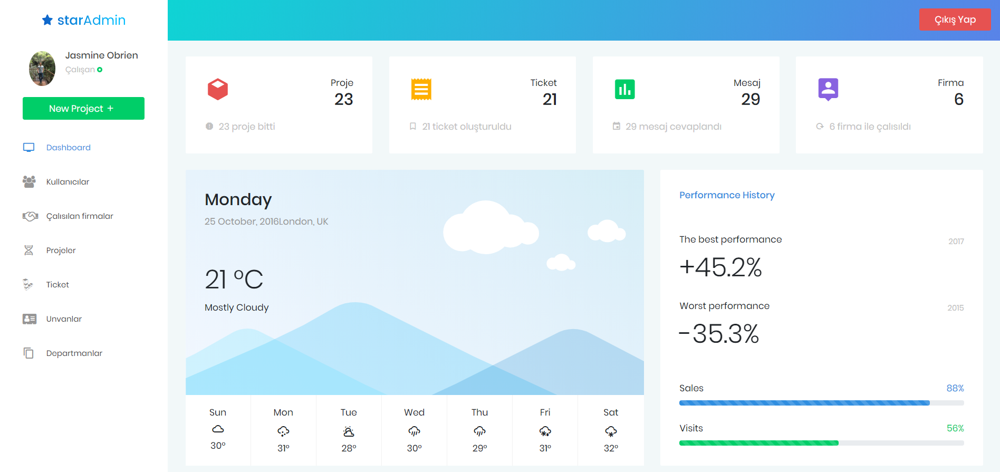

# StarProject Angular

<b>1.1. Projenin Amacı ve Uygulama Alanları</b> 
	Projenin amacı, bir yazılım şirketinin müşterileri tarafından gelen destek talepleri veya şirket içerisinde yapılması gereken işlerin takibinin sağlanması, işi gerçekleştirecek kişiye yönlendirilmesi ve iş gerçekleştirildikten sonra ilgili departmana veya müşteriye dönüş işlemlerinin yapılmasını sağlayan bir yazılı geliştirmektir. Yazılım projeleri geliştikçe bu projelerin takibi ve yürütüme zorlaşır ve belli bir aşamadan sonra çözülemez hale gelir. Bizim projemizin amacı bu karmaşıklığı ortadan kaldırmaya yardımcı olmaktır. Uygulama alanı bir yazılım şirketinin müşterini, müşterilere ait projeleri ve projelere ait iş süreçlerinin tanımlanması ve ilgili personele atanması olarak tanımlanabilir. Yapılan çalışma bir yazılım şirketi tarafından kullanılmaya başlandığı anda iş yönetim süreci takip altına alınacak ve böylece iş karmaşıklığı azaltılarak daha hızlı bir şekilde aksiyonlar gerçekleştirilebilecektir. 
    

 
 
 
